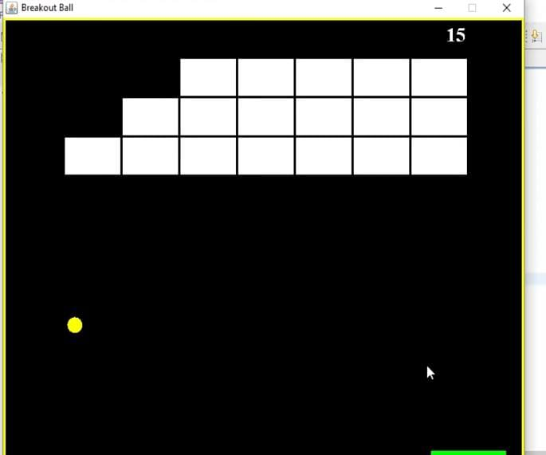
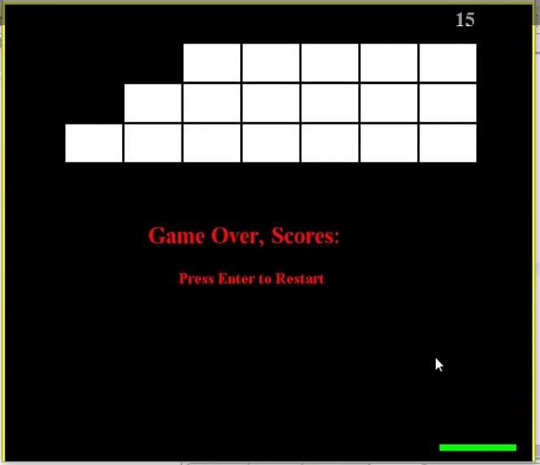

# Brick-Bracker-Game
Developed a simple brick bracker game using java Swing and AWT  in this game user can break the bricks using a ball by clicking left and right button .Game GUI. is user friendly so anyone can play easily .

i'm attesting some of the snapshot of the working model of the project.

